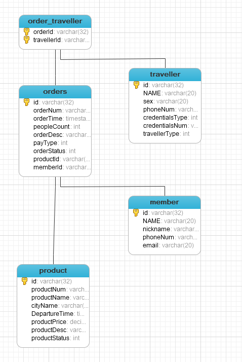
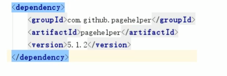
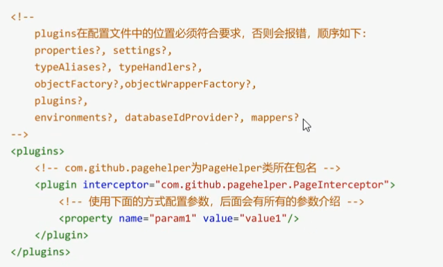
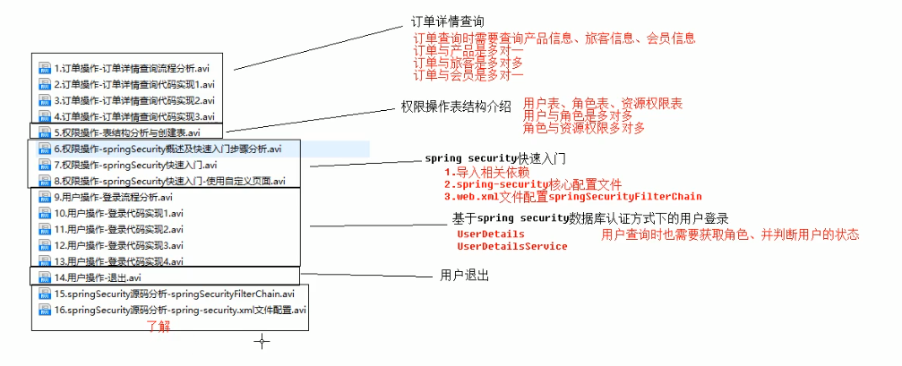

# 流程图 
## 数据库表图 

## 1.添加物品 

当添加完成之后重新查询一下添加的产品，也就是调用findALLdo

## 2.订单详情页面

## pagehelper使用步骤 
* 1.导入maven  

* 2.在mybatis中配置xml配置拦截器插件  
    
* 3.需要在Spring配置文件中配置 
 
 
 
## 功能  
 

## SpringSecurity 框架 
Spring Security框架用来提供安全认证服务的框架。